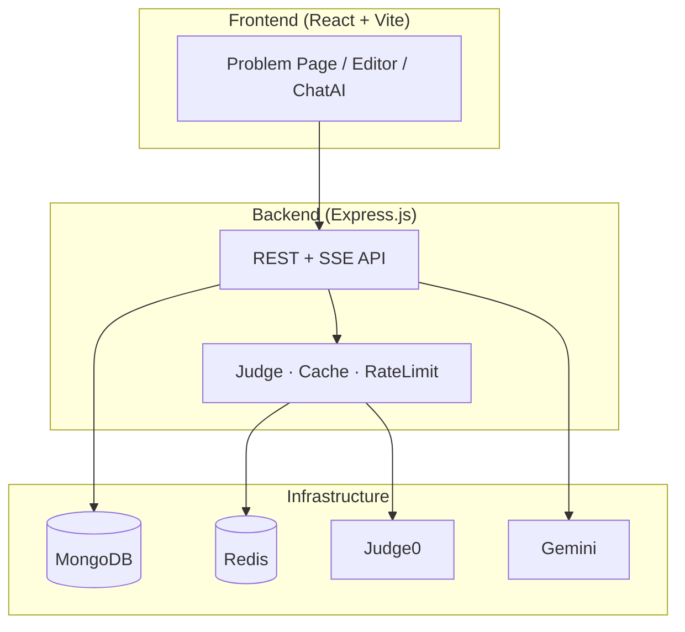

# StudyBuddy

A full-stack **LeetCode-style coding platform** for practicing Data Structures & Algorithms. Solve problems, run code against test cases, submit solutions, chat with an AI tutor, discuss approaches, and follow a structured learning roadmap.


---

## Features

- **Problem Solving** — Monaco code editor with C++, Java, and JavaScript support
- **Run Code** — Test against visible examples with Redis-backed execution cache
- **Submit Solution** — Grade against hidden test cases via Judge0
- **Intelligent Cache** — SHA-256 keyed cache minimizes redundant Judge0 calls (Run only)
- **Rate Limiting** — Redis-backed per-user run limits with clear frontend feedback
- **AI Tutor** — Streaming Gemini chat scoped to the current problem (hints, code review)
- **Discussions** — Threads, comments, and upvotes per problem
- **Learning Roadmap** — Topic-based progress (Array, Linked List, Graph, DP)
- **Editorial Videos** — Cloudinary-hosted solution walkthroughs
- **Admin Panel** — Create/update/delete problems with reference solution validation
- **User Profiles** — Solve stats, acceptance rate, submission history

---

## Architecture



**Layered backend design:** Routes → Middleware → Controllers → Services → Utils

📖  **[Architecture Overview](./docs/architecture/OVERVIEW.md)**

---

## Tech Stack

| Layer | Technologies |
|-------|-------------|
| Frontend | React 19, Vite 6, Redux Toolkit, React Hook Form, TailwindCSS 4, DaisyUI, Monaco Editor, react-markdown |
| Backend | Node.js, Express 5, Mongoose 8, bcrypt, JWT |
| Database | MongoDB Atlas |
| Cache / Session | Redis Cloud |
| Code Execution | Judge0 CE (RapidAPI) |
| AI | Google Gemini 2.5 Flash |
| Media | Cloudinary |

---

## Project Structure

```
StudyBuddy/
├── backend/
│   └── src/
│       ├── config/          # DB, Redis, cache & rate limit config
│       ├── controllers/       # Request handlers
│       ├── middleware/        # Auth, rate limiting
│       ├── models/            # Mongoose schemas
│       ├── routes/            # Express routers
│       ├── services/          # Judge0, execution cache, rate limit
│       └── utils/             # Hashing, errors, AI prompts
├── frontend/
│   └── src/
│       ├── pages/             # Route views
│       ├── components/        # UI components
│       └── utils/             # API client, streaming, error handling
└── docs/                      # Detailed technical documentation
```

---

## Getting Started

### Prerequisites

- Node.js 18+
- MongoDB Atlas account (or local MongoDB)
- Redis Cloud account (or local Redis)
- Judge0 RapidAPI key
- Google Gemini API key

### Environment Variables

**Backend** (`backend/.env`):

```env
PORT=3000
MONGO_URI=mongodb+srv://...
JWT_KEY=your_jwt_secret
REDIS_PASS=your_redis_password
REDIS_HOST=your_redis_host
REDIS_PORT=12138
JUDGE0_KEY=your_rapidapi_key
GEMINI_KEY=your_gemini_key

# Optional
EXECUTION_CACHE_TTL_SECONDS=3600
RUN_RATE_LIMIT_MAX=30
RUN_RATE_LIMIT_WINDOW_SECONDS=60
```

**Frontend** (`frontend/.env`):

```env
VITE_API_URL=http://localhost:3000
```

### Installation

```bash
# Backend
cd backend
npm install
npm run dev

# Frontend (new terminal)
cd frontend
npm install
npm run dev
```

- Frontend: `http://localhost:5173`
- Backend: `http://localhost:3000`

---

## API Overview

| Endpoint | Method | Description |
|----------|--------|-------------|
| `/user/register` | POST | Create account |
| `/user/login` | POST | Login (JWT cookie) |
| `/user/logout` | POST | Logout + Redis blocklist |
| `/problem/getAllProblem` | GET | List problems |
| `/problem/problemById/:id` | GET | Problem details |
| `/submission/run/:id` | POST | Run against visible tests (cached) |
| `/submission/submit/:id` | POST | Submit against hidden tests |
| `/ai/chat/stream` | POST | Streaming AI tutor (SSE) |
| `/discussion/:problemId/threads` | GET/POST | Discussion threads |
| `/roadmap` | GET | Learning roadmap + progress |
| `/cache/stats` | GET | Cache metrics (admin) |

---

## Key Design Highlights

### Execution Cache (Run Code)

```
Client → SHA256(lang + code + stdin) → Redis GET run:{hash}
  ├── HIT  → return cached result (⚡ Served from Cache)
  └── MISS → Judge0 → SETEX → return result
```

- **Submit always hits Judge0** — grading integrity preserved
- **Redis failure** → graceful fallback, execution continues

### Error Handling

Judge0 HTTP errors and `status_id` codes are classified into user-safe messages. Internal errors (status 13) never leak system details to the frontend.

### AI Streaming

Server-Sent Events deliver Gemini tokens incrementally. Frontend renders Markdown live with syntax-highlighted code blocks.

---

## License

This project is for educational purposes.

---

## Author

Built as a comprehensive DSA practice platform with production-oriented patterns: caching, rate limiting, structured error handling, streaming AI, and layered architecture.
