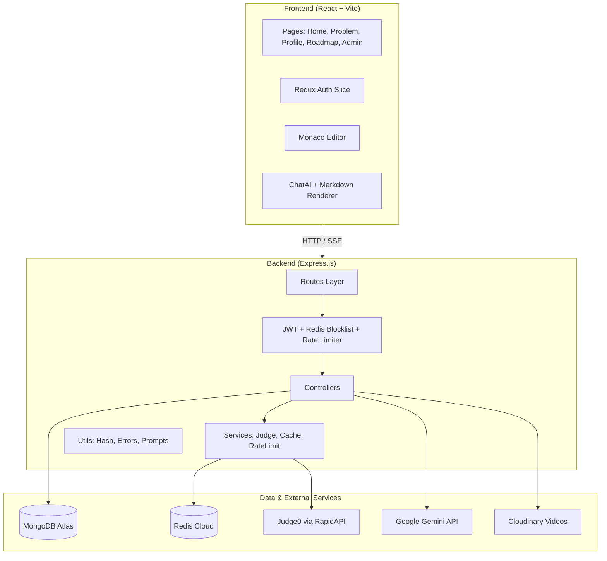
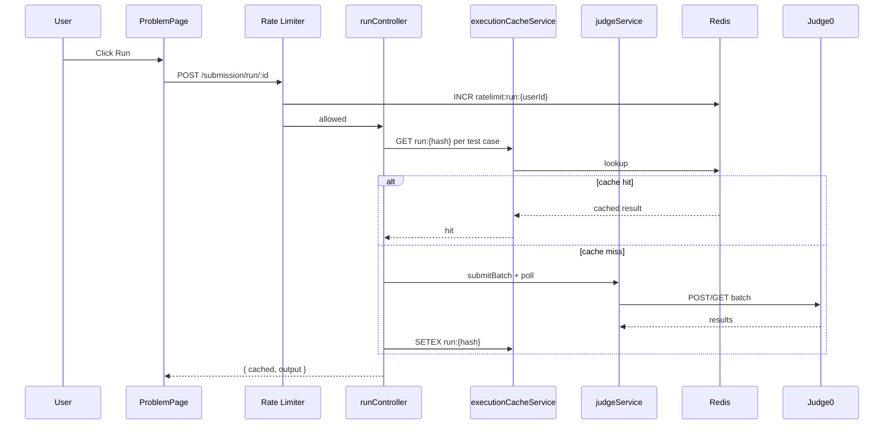

# StudyBuddy — System Architecture Overview

## What Is StudyBuddy?

StudyBuddy is a **LeetCode-style coding platform** where users solve DSA problems, run code against test cases, submit solutions, discuss approaches, follow a learning roadmap, watch editorial videos, and chat with an AI tutor — all scoped to the current problem.

---

## High-Level Architecture



---

## Technology Stack

| Layer | Technology |
|-------|------------|
| Frontend | React 19, Vite 6, Redux Toolkit, React Hook Form, TailwindCSS 4, DaisyUI, Monaco Editor |
| Backend | Node.js, Express 5, Mongoose 8 |
| Database | MongoDB |
| Cache / Session | Redis 5 (blocklist, execution cache, rate limits, stats) |
| Code Execution | Judge0 CE (RapidAPI) |
| AI | Google Gemini 2.5 Flash (`@google/genai`) |
| Media | Cloudinary (solution/editorial videos) |

---

## Backend Layered Design

```
Request → Route → Middleware → Controller → Service → External API / DB
```

| Layer | Responsibility |
|-------|----------------|
| **Routes** | HTTP path mapping, middleware chaining |
| **Middleware** | Auth, admin check, rate limiting |
| **Controllers** | Request validation, orchestration, HTTP response |
| **Services** | Reusable business logic (Judge0, cache, rate limit) |
| **Utils** | Pure helpers (hashing, error parsing, prompts) |
| **Models** | Mongoose schemas |
| **Config** | DB, Redis, TTL, rate limit constants |

---

## API Surface

| Prefix | Module | Auth |
|--------|--------|------|
| `/user` | Register, login, logout, profile | Mixed |
| `/problem` | CRUD problems, list, fetch by ID | User / Admin |
| `/submission` | Run code, submit solution | User |
| `/ai` | Chat, streaming chat | User |
| `/video` | Editorial / solution videos | Admin / User |
| `/discussion` | Threads, comments, upvotes | User |
| `/roadmap` | Learning path by topic | User / Admin |
| `/cache` | Execution cache stats | Admin |

---

## Core Data Models

```
User ──< Submission >── Problem
User ──< DiscussionThread / Comment >── Problem
User.problemSolved[] ──> Problem
RoadmapTopic ──> Problem[] (by tag)
SolutionVideo ──> Problem
```

---

## Critical Cross-Cutting Concerns

### 1. Authentication
- JWT stored in **httpOnly cookie** (`token`)
- Logout adds token to Redis blocklist: `token:{jwt}` until natural expiry
- `userMiddleware` / `adminMiddleware` verify JWT + blocklist on every protected route

### 2. Code Execution (Run vs Submit)
| Feature | Test Cases | Cache | DB Write | Rate Limit |
|---------|-----------|-------|----------|------------|
| **Run** | Visible | Yes (Redis) | No | Yes |
| **Submit** | Hidden | No | Yes | No |

### 3. Fault Tolerance Patterns
- **Redis down** → cache skipped, rate limit skipped, auth blocklist may fail open/closed depending on path
- **Judge0 errors** → typed `Judge0Error` with user-safe messages
- **AI stream disconnect** → server stops writing SSE chunks

---

## Request Lifecycle Example (Run Code)



---

## Folder Map

```
StudyBuddy/
├── backend/src/
│   ├── config/       db, redis, cacheConfig, rateLimitConfig
│   ├── controllers/  HTTP handlers
│   ├── middleware/   auth, rate limit
│   ├── models/       Mongoose schemas
│   ├── routes/       Express routers
│   ├── services/     judge, cache, rateLimit
│   └── utils/        hash, errors, prompts, validators
├── frontend/src/
│   ├── pages/        route-level views
│   ├── components/   reusable UI
│   ├── utils/        axios, streaming, judge0 status
│   └── store/        Redux
└── docs/             this documentation
```

---

## Environment Variables

| Variable | Purpose |
|----------|---------|
| `PORT` | Backend port |
| `MONGO_URI` | MongoDB connection |
| `JWT_KEY` | JWT signing secret |
| `REDIS_PASS`, `REDIS_HOST`, `REDIS_PORT` | Redis Cloud |
| `JUDGE0_KEY` | RapidAPI Judge0 key |
| `GEMINI_KEY` | Google Gemini API key |
| `EXECUTION_CACHE_TTL_SECONDS` | Cache TTL (default 3600) |
| `RUN_RATE_LIMIT_MAX` | Max runs per window (default 30) |
| `RUN_RATE_LIMIT_WINDOW_SECONDS` | Rate limit window (default 60) |
| `VITE_API_URL` | Frontend → backend URL |

---

## Scaling Considerations (Platform-Level)

| Bottleneck | Current | Scale Strategy |
|------------|---------|----------------|
| Judge0 API | External, rate-limited | Execution cache, queue workers, self-hosted Judge0 |
| Redis | Single instance | Redis Cluster, separate instances per concern |
| MongoDB | Single cluster | Read replicas, sharding by userId |
| Express | Single process | PM2 cluster / horizontal pods behind load balancer |
| AI streaming | Sync per request | Dedicated AI gateway, request queue, model routing |
| SSE connections | 1 per chat | Sticky sessions, connection limits per user |

---
